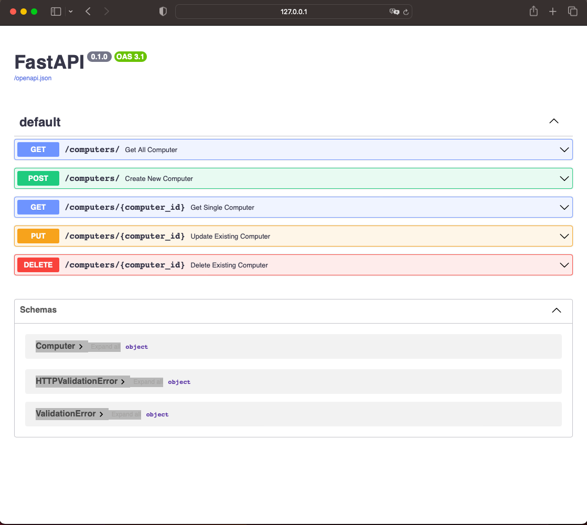

# SampleCompany: Computer Tracking Solution

This is a simple computer tracking solution implemented in **Python** using the **FastAPI** framework. The application runs on the **Uvicorn** web server and utilizes **SQLite** as the database with the help of SQLAlchemy.

## Assumptions:
- Each computer's MAC address is unique.
- Only IPv4 addresses are used; IPv6 addresses are not considered.

## Setup the App Environment:
1. Clone the project locally.
2. Open a terminal or command line in the **simple_solution** directory.
3. Create a new environment named **env** with the command `python -m venv env`.
4. After successfully creating the environment, activate it using the command `source env/bin/activate` (for Unix-like systems) or `env\Scripts\activate` (for Windows).
5. Run the command `pip install -r requirements.txt` to install all required dependencies.

## Running the App:
1. Ensure the Greenbone notification server is running properly and the local **port 8080** is mapped to its running Docker image.
2. Open a terminal or command prompt in the **app/** subdirectory.
3. Execute the command `uvicorn main:app --reload`.
4. Verify that the application starts up correctly and Uvicorn is running on its default configuration at **http://127.0.0.1:8000**.

## Testing the App:
1. Using a web browser, open the link **http://127.0.0.1:8000**, which will redirect you to the Swagger documentation at **http://127.0.0.1:8000/docs**. This will allow you to perform the endpoints functional tests, as shown in the screenshot:

2. On the other hand, you can also verify the functionality of `main.py` using `pytest` testing freamwork using the command `pytest test_main.py`.

Please note that this solution can be further improved by implementing more unit testing for better code quality and reliability.
The current implementation does not include any validation checks for the computer entries' IP addresses or MAC addresses... However, these checks could be implemented at the front-end level to ensure data integrity and accuracy.